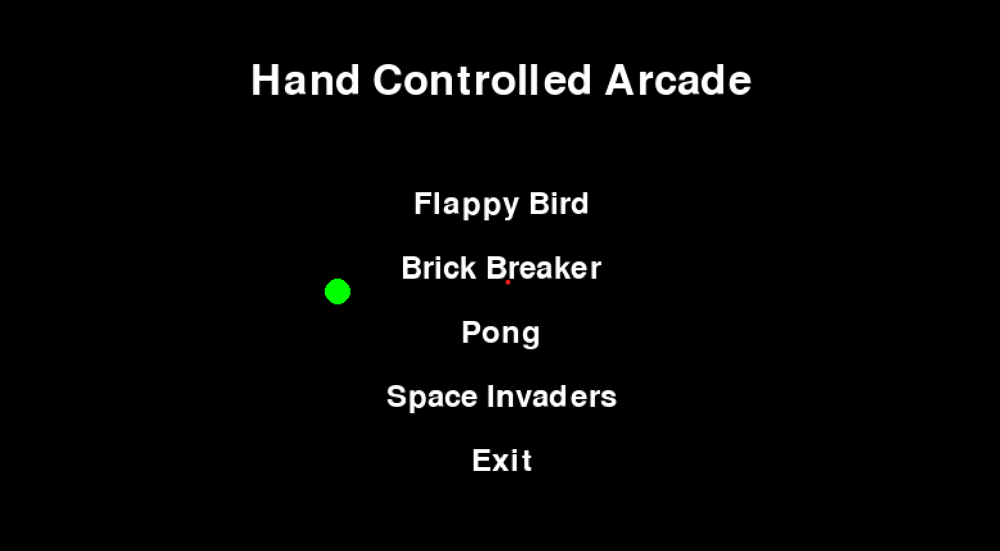
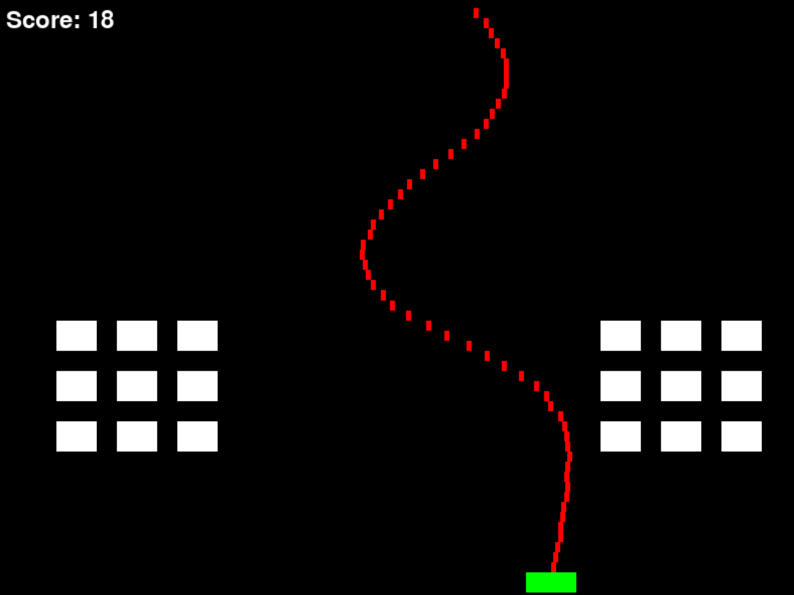

# Hand-Controlled-Arcade

Hand Controlled Arcade is an interactive Python-based arcade game suite that utilizes hand gestures to control the main menu and play various classic games. The project uses OpenCV for hand tracking and Pygame for game development. 

## Features

- **Hand Tracking**: Use hand gestures to navigate the main menu and control the games.
- **Main Menu**: Choose between different classic arcade games or exit the program.
- **Games Included**:
  - Flappy Bird
  - Brick Breaker
  - Pong
  - Space Invaders
- **Gesture Control**: 
  - Navigate the menu and games using hand gestures.
  - Select an option by putting your index finger and thumb together.
- **In-Game Menu**: Pause and resume games, or return to the main menu.

## Prerequisites

- Python 3.x
- Pygame
- OpenCV
